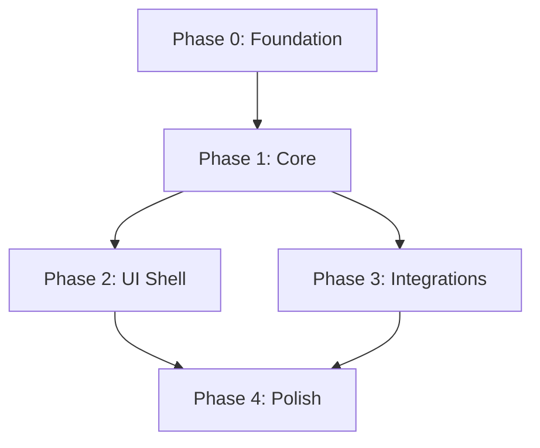

# SaveState Reborn: Implementation Guide
## Phased Construction Roadmap

**Document ID:** SS-IG-001  
**Revision:** 1.0  
**Date:** 2024-12-20

---

## 1. Overview

| Phase | Focus | Duration | Milestone |
|-------|-------|----------|-----------|
| **Phase 0** | Foundation | 1 week | Project scaffold, builds |
| **Phase 1** | Core | 2 weeks | Database, providers working |
| **Phase 2** | UI Shell | 2 weeks | Avalonia app running |
| **Phase 3** | Integrations | 3 weeks | All stores connected |
| **Phase 4** | Polish | 2 weeks | AOT, testing, docs |
| **Total** | | **10 weeks** | Production release |

---

## 2. Dependency Graph



---

## 3. Phase 0: Foundation (Week 1)

### Goals
- Project scaffold created
- All projects build
- CI/CD pipeline running

### Tasks

| ID | Task | Dependency | Est |
|----|------|------------|-----|
| 0.1 | Create solution structure | - | 2h |
| 0.2 | Add SaveState.Core project | 0.1 | 1h |
| 0.3 | Add SaveState.UI project (Avalonia) | 0.1 | 2h |
| 0.4 | Add SaveState.App entry point | 0.2, 0.3 | 1h |
| 0.5 | Configure Directory.Build.props | 0.1 | 1h |
| 0.6 | Add EF Core + SQLite | 0.2 | 2h |
| 0.7 | Configure AOT settings | 0.5 | 1h |
| 0.8 | Setup GitHub Actions CI | 0.4 | 2h |
| 0.9 | Verify `dotnet publish` AOT | 0.7, 0.8 | 2h |

### Commands

```powershell
# 0.1 Create solution
dotnet new sln -n SaveState
mkdir src tests docs

# 0.2 Core library
dotnet new classlib -n SaveState.Core -o src/SaveState.Core
dotnet sln add src/SaveState.Core

# 0.3 Avalonia app
dotnet new avalonia.app -n SaveState.UI -o src/SaveState.UI
dotnet sln add src/SaveState.UI

# 0.4 Entry point
dotnet new console -n SaveState.App -o src/SaveState.App
dotnet sln add src/SaveState.App
dotnet add src/SaveState.App reference src/SaveState.Core src/SaveState.UI
```

### Exit Criteria
- [x] `dotnet build` succeeds
- [x] `dotnet publish -c Release` produces AOT binary
- [x] CI pipeline green

---

## 4. Phase 1: Core (Weeks 2-3)

### Goals
- Database schema defined
- Provider interface established
- Basic CRUD operations

### Tasks

| ID | Task | Dependency | Est |
|----|------|------------|-----|
| 1.1 | Define Game entity | - | 2h |
| 1.2 | Define Platform, Image entities | 1.1 | 2h |
| 1.3 | Create DbContext | 1.2 | 2h |
| 1.4 | Add migrations | 1.3 | 1h |
| 1.5 | Implement GameService CRUD | 1.4 | 4h |
| 1.6 | Define IGameProvider interface | - | 2h |
| 1.7 | Create provider registration | 1.6 | 2h |
| 1.8 | Add gRPC IPC service | - | 4h |
| 1.9 | Implement single-instance lock | 1.8 | 2h |

### Key Deliverables
```csharp
// Provider contract
public interface IGameProvider { ... }

// Database context
public class SaveStateDb : DbContext { ... }

// IPC service
public class IpcService : SaveStateIpc.SaveStateIpcBase { ... }
```

### Exit Criteria
- [ ] Database created on first run
- [ ] Games can be added/removed via service
- [ ] Second instance sends command to first

---

## 5. Phase 2: UI Shell (Weeks 4-5)

### Goals
- Main window renders
- Game grid displays
- Basic navigation

### Tasks

| ID | Task | Dependency | Est |
|----|------|------------|-----|
| 2.1 | Create MainWindow layout | - | 4h |
| 2.2 | Implement sidebar navigation | 2.1 | 4h |
| 2.3 | Create GameCard control | - | 4h |
| 2.4 | Implement GameGridView | 2.3 | 4h |
| 2.5 | Add MainViewModel | 2.4 | 4h |
| 2.6 | Bind to GameService | 2.5, 1.5 | 2h |
| 2.7 | Add dark/light themes | 2.1 | 4h |
| 2.8 | Implement Settings view | 2.2 | 4h |

### Exit Criteria
- [ ] App window opens
- [ ] Games display in grid
- [ ] Theme switching works

---

## 6. Phase 3: Integrations (Weeks 6-8)

### Goals
- All store providers working
- Metadata fetching operational

### Tasks

| ID | Task | Dependency | Est |
|----|------|------------|-----|
| 3.1 | Implement SteamProvider | 1.6 | 8h |
| 3.2 | Implement GogProvider | 1.6 | 6h |
| 3.3 | Implement EpicProvider | 1.6 | 8h |
| 3.4 | Implement XboxProvider | 1.6 | 8h |
| 3.5 | Implement EaProvider | 1.6 | 6h |
| 3.6 | Implement UbisoftProvider | 1.6 | 6h |
| 3.7 | Implement IgdbMetadataProvider | - | 8h |
| 3.8 | Implement SteamGridDbProvider | - | 4h |
| 3.9 | Add ROM scanning service | - | 8h |
| 3.10 | Add RetroAchievements client | - | 8h |

### Provider Implementation Order
1. **Steam** (most common, well-documented)
2. **GOG** (simpler API)
3. **Epic** (reverse-engineered)
4. **Xbox** (UWP APIs)
5. **EA/Ubisoft** (registry/DB based)

### Exit Criteria
- [ ] Each provider lists installed games
- [ ] Metadata downloads automatically
- [ ] ROMs detected and matched

---

## 7. Phase 4: Polish (Weeks 9-10)

### Goals
- Production-ready build
- Tests passing
- Documentation complete

### Tasks

| ID | Task | Dependency | Est |
|----|------|------------|-----|
| 4.1 | Write unit tests (80% coverage) | All | 16h |
| 4.2 | Write integration tests | 3.* | 8h |
| 4.3 | Optimize AOT binary size | - | 4h |
| 4.4 | Measure startup time | 4.3 | 2h |
| 4.5 | Create installer (Windows) | - | 4h |
| 4.6 | Create Flatpak (Linux) | - | 4h |
| 4.7 | Update all documentation | All | 8h |
| 4.8 | Final security review | - | 4h |
| 4.9 | Release v1.0.0 | All | 2h |

### Exit Criteria
- [ ] All tests green
- [ ] Binary < 50MB
- [ ] Startup < 200ms
- [ ] Installers built
- [ ] GitHub Release published

---

## 8. Risk Mitigations by Phase

| Phase | Primary Risk | Mitigation |
|-------|-------------|------------|
| 0 | AOT config issues | Test early, isolate |
| 1 | Schema changes | Migrations from start |
| 2 | Avalonia learning curve | Use templates |
| 3 | Store API changes | Abstract well |
| 4 | Test coverage gaps | Track continuously |

---

## 9. Decision Log Reference

Track implementation decisions in the Build Log (SS-BL-001) using:
- **DR-XXX** for decisions
- **AR-XXX** for issues found
- **RES-XXX** for resolutions
