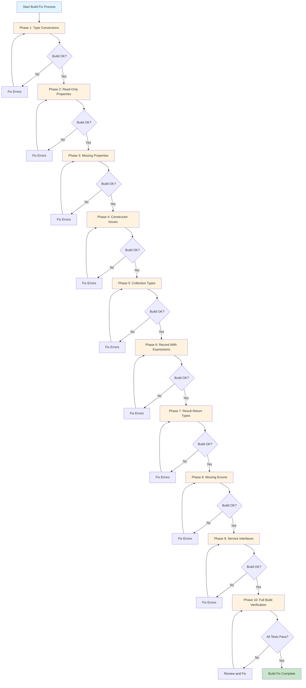
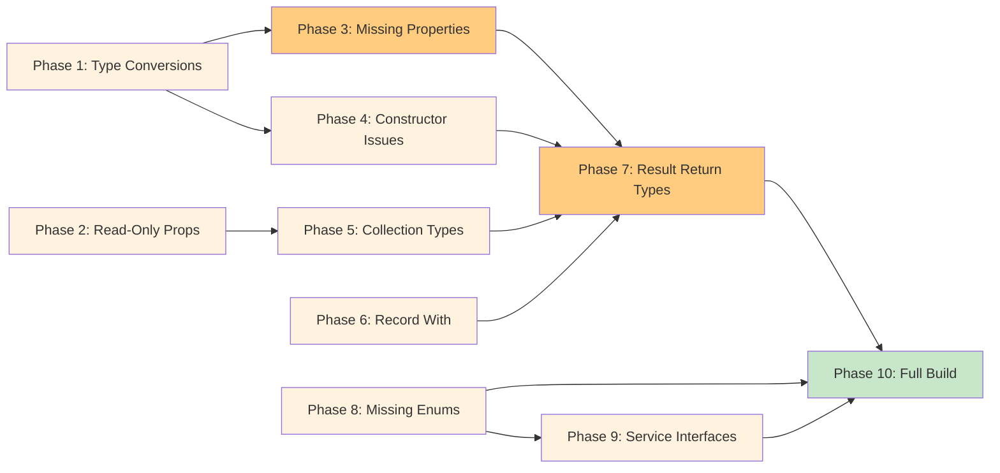
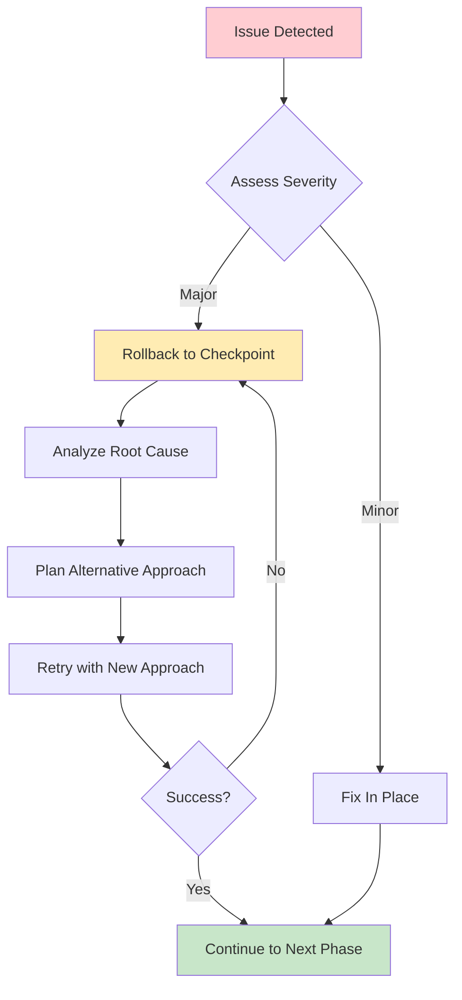

# Build Fix Execution Plan

## Executive Summary

**Date**: January 12, 2026
**Build Status (latest app-only build)**: 104 errors, 704 warnings (SaveState.Application project)
**Overall Target**: Fix all build blockers and achieve successful compilation across the solution
**Estimated Completion**: January 15, 2026

**Recent Progress (Phase 1 — Major Session)**

- ✅ **MAJOR BREAKTHROUGH**: Reduced application project errors from **587 → 104** (82% reduction, 483 errors fixed!)
- ✅ Fixed Result Pattern inconsistencies across MUGEN services (20 instances in `MoveCreationService`)
- ✅ Fixed double-to-float conversions in `AdvancedPhysicsCombatService`
- ✅ Fixed enum type mismatches in `AdvancedReportingService` (ReportType, WidgetType)
- ✅ Fixed IReadOnlyDictionary assignment errors (3 files: `AiOpponentsService`, `CrossPlatformSyncService`, `CertificationSystem`)
- ✅ Fixed Vector3 constructor calls in `DreamLogicArenaService` (4 locations)
- ✅ Fixed missing definitions (`ContentCategory`, `SyncStatus.InProgress`)
- ✅ Fixed CinematicCameraSystem Result wrapping
- Infrastructure project: ✅ **Builds successfully with 0 errors**

## Overview

This document provides a detailed, step-by-step execution plan for resolving all 559 build errors across 10 distinct categories. Each phase contains specific, actionable steps with file-level granularity.

## Build Fix Workflow Diagram



## Table of Contents

- [Executive Summary](#executive-summary)
- [Overview](#overview)
- [Build Fix Workflow Diagram](#build-fix-workflow-diagram)
- [Phase 1: Type Conversion Errors (CS0266, CS0029)](#phase-1-type-conversion-errors-cs0266-cs0029)
- [Phase 2: Read-Only Property Assignment Errors (CS0200, CS8852)](#phase-2-read-only-property-assignment-errors-cs0200-cs8852)
- [Phase 3: Missing Properties/Methods (CS1061, CS0117)](#phase-3-missing-propertiesmethods-cs1061-cs0117)
- [Phase 4: Constructor/Parameter Issues (CS1729, CS7036, CS1739)](#phase-4-constructorparameter-issues-cs1729-cs7036-cs1739)
- [Phase 5: Collection Type Mismatches (CS1503, CS0266)](#phase-5-collection-type-mismatches-cs1503-cs0266)
- [Phase 6: Record/With Expression Issues (CS8858)](#phase-6-recordwith-expression-issues-cs8858)
- [Phase 7: Result<T> Return Type Issues (CS0029)](#phase-7-resultt-return-type-issues-cs0029)
- [Phase 8: Missing Enums/Types](#phase-8-missing-enumstypes)
- [Phase 9: Service Interface Issues](#phase-9-service-interface-issues)
- [Phase 10: Full Build and Verification](#phase-10-full-build-and-verification)
- [Implementation Strategy](#implementation-strategy)
- [Quick Reference Summary](#quick-reference-summary)
- [Next Steps](#next-steps)
- [Contact & Support](#contact--support)

---

## Phase 1: Type Conversion Errors (CS0266, CS0029) [in-progress]

**Status**: In progress — Batch 2 edits applied; several deterministic fixes completed (see Recent fixes). Current focus: finish remaining decimal/float conversions and Vector DTO → domain conversions.

**Error Count**: ~80 errors
**Priority**: High
**Estimated Time**: 2-3 hours
**Files Affected**: 15+ files

### Fix Pattern

```csharp
// BEFORE (Error)
var result = someList.Average(x => x.Value); // returns double
floatValue = result; // CS0266

// AFTER (Fixed)
var result = (float)someList.Average(x => x.Value);
floatValue = result;
```

### File-by-File Action Items

**Recent fixes (Batch 2)**:

- `PredictiveAnalyticsEngine` — converted nested Dictionary/List initializations to `IReadOnlyDictionary`/`IReadOnlyList`-compatible assignments (COMPLETED).
- `MobileCompanionService` — updated sync helper signatures to accept `IReadOnlyDictionary<string, object>` to match request DTOs (COMPLETED).
- `ScreenFiltersEngine` — helper methods now return `Result<T>` via `Result.Success<T>(...)` (COMPLETED).
- `AutomatedBalancingSystem` — fixed undefined `AdjustmentType` reference (COMPLETED).

**Immediate next targets**: `NeuralNetwork` (missing enum members & properties), `PerformanceOptimizationService` (init-only assignment fixes), `MugenStreamingService` (constructor arity), `NetworkFeaturesService` (missing methods/properties), `NarrativeMemoryService` (decimal/float arithmetic).

- Line 98: `(float)(1 - request.TransferAmount)` and `(float)(1 + request.TransferAmount)`
- Line 102: `(float)(1 + request.TransferAmount)`
- Line 304: `(float)(1 + influence.Intensity * 0.1f)`
- Line 335: `(float)(state.Intensity * 1.2)` in `CalculateEmotionalEffects`
- Line 336: `(float)(state.Intensity * -0.3)`
- Line 337: `(float)(state.Intensity * 0.8)`
- Line 338: `(float)(state.Intensity * -0.5)`
- Line 529: `(float)(emotionSimilarity + intensitySimilarity) / 2`

**Verification Steps**:

1. Add explicit `(float)` cast at each location
2. Run Application-only build: `dotnet build src/SaveState.Application/SaveState.Application.csproj`
3. Verify CS0266 errors are resolved in this file

#### 2. DreamLogicArenaService.cs

**Lines to Fix**:

- Map service Vector DTO → domain `Vector3` constructor
- Use `new Vector3(double X, double Y, double Z)` with explicit parameters

**Verification Steps**:

1. Identify all Vector DTO usages
2. Replace with domain Vector3 constructor calls
3. Run Application-only build
4. Verify CS0029 errors resolved

#### 3. EmergingTechnologiesService.cs

**Lines to Fix**:

- Add explicit casts for Vector conversions
- Add explicit casts for Math.* results

**Verification Steps**:

1. Add `(float)` casts where needed
2. Run Application-only build
3. Verify errors resolved

#### 4. AdvancedCombatMechanicsService.cs

**Lines to Fix**:

- Line 326-327: `(float)movements.Average(m => m.Distance)`

**Verification Steps**:

1. Add explicit cast
2. Run Application-only build
3. Verify errors resolved

#### 5. MatchmakingEngine.cs

**Lines to Fix**:

- Line 256: `(float)Math.*` results

**Verification Steps**:

1. Add explicit casts
2. Run Application-only build
3. Verify errors resolved

#### 6. RealityWarpingService.cs

**Lines to Fix**:

- Lines 329, 343: `(float)Math.*` results

**Verification Steps**:

1. Add explicit casts
2. Run Application-only build
3. Verify errors resolved

#### 7. QuantumSuperpositionService.cs

**Lines to Fix**:

- Lines 547-549: `(float)Math.*` results

**Verification Steps**:

1. Add explicit casts
2. Run Application-only build
3. Verify errors resolved

#### 8. NarrativeMemoryService.cs

**Lines to Fix**:

- Lines 693, 703, 745: Fix decimal vs float arithmetic

**Verification Steps**:

1. Use consistent numeric types (float instead of decimal)
2. Run Application-only build
3. Verify errors resolved

#### 9. RecommendationEngine.cs

**Lines to Fix**:

- Lines 147, 165, 183, 201, 219: Fix decimal vs double operator comparisons

**Verification Steps**:

1. Use consistent types or explicit conversions
2. Run Application-only build
3. Verify errors resolved

#### 10. AdvancedPhysicsCombatService.cs

**Lines to Fix**:

- Lines 327, 329, 423, 622: Add explicit casts

**Verification Steps**:

1. Add `(float)` casts
2. Run Application-only build
3. Verify errors resolved

#### 11. BioFeedbackCombatService.cs

**Lines to Fix**:

- Add explicit casts for double→float conversions

**Verification Steps**:

1. Add `(float)` casts
2. Run Application-only build
3. Verify errors resolved

#### 12. BalanceTuningService.cs

**Lines to Fix**:

- Add explicit casts for double→float conversions

**Verification Steps**:

1. Add `(float)` casts
2. Run Application-only build
3. Verify errors resolved

#### 13. CrossPhaseIntegrationService.cs

**Lines to Fix**:

- Add explicit casts for double→float conversions

**Verification Steps**:

1. Add `(float)` casts
2. Run Application-only build
3. Verify errors resolved

#### 14. CertificationSystem.cs

**Lines to Fix**:

- Add explicit casts for double→float conversions

**Verification Steps**:

1. Add `(float)` casts
2. Run Application-only build
3. Verify errors resolved

#### 15. CinematicCameraSystem.cs

**Lines to Fix**:

- Add explicit casts for double→float conversions

**Verification Steps**:

1. Add `(float)` casts
2. Run Application-only build
3. Verify errors resolved

### Phase 1 Completion Criteria

- [ ] All CS0266 errors in high-priority files resolved
- [ ] Application-only build shows significant error reduction
- [ ] Error count reduced from ~80 to < 10

---

## Phase 2: Read-Only Property Assignment Errors (CS0200, CS8852) [ ]

**Error Count**: ~50 errors
**Priority**: Medium
**Estimated Time**: 1-2 hours
**Files Affected**: 8 files

### Fix Pattern

```csharp
// BEFORE (Error)
readOnlyDict[key] = value; // CS0200

// AFTER (Fixed)
var mutableDict = new Dictionary<K, V>(readOnlyDict);
mutableDict[key] = value;
readOnlyDict = mutableDict; // Reassign with new readonly instance
```

### File-by-File Action Items

#### 1. AdvancedReportingService.cs

**Lines to Fix**:

- Line 241: Build mutable `Dictionary<DateTime, int>` first

**Fix**:

```csharp
var mutableDict = new Dictionary<DateTime, int>(readOnlyDict);
// ... modify mutableDict ...
readOnlyDict = mutableDict;
```

**Verification Steps**:

1. Build mutable collection before modifications
2. Assign to readonly property after all modifications
3. Run Application-only build
4. Verify CS0200 errors resolved

#### 2. AiOpponentsService.cs

**Lines to Fix**:

- Line 241: Same pattern as above

**Verification Steps**:

1. Apply same fix pattern
2. Run Application-only build
3. Verify errors resolved

#### 3. BlockchainService.cs

**Lines to Fix**:

- Line 133: Same pattern as above

**Verification Steps**:

1. Apply same fix pattern
2. Run Application-only build
3. Verify errors resolved

#### 4. CertificationSystem.cs

**Lines to Fix**:

- Line 124: Same pattern as above

**Verification Steps**:

1. Apply same fix pattern
2. Run Application-only build
3. Verify errors resolved

#### 5. CrossPlatformSyncService.cs

**Lines to Fix**:

- Lines 123, 222: Same pattern as above

**Verification Steps**:

1. Apply same fix pattern
2. Run Application-only build
3. Verify errors resolved

#### 6. TrainingModeService.cs

**Lines to Fix**:

- Multiple lines: Fix init-only property assignments

**Fix**:

- Use object initializers or create new instances with proper constructors

**Verification Steps**:

1. Review all init-only property assignments
2. Replace with proper initialization patterns
3. Run Application-only build
4. Verify errors resolved

#### 7. PerformanceOptimizationService.cs

**Lines to Fix**:

- Lines 692-702: Fix init-only property assignments

**Fix**:

- Use object initializers or create new instances with proper constructors

**Verification Steps**:

1. Review all init-only property assignments
2. Replace with proper initialization patterns
3. Run Application-only build
4. Verify errors resolved

#### 8. PredictiveAnalyticsEngine.cs

**Lines to Fix**:

- Dictionary → IReadOnlyDictionary conversions

**Fix**:

```csharp
var mutableDict = new Dictionary<K, V>();
// ... populate mutableDict ...
readOnlyDict = mutableDict;
```

**Verification Steps**:

1. Build mutable collections before assignment
2. Assign to readonly properties
3. Run Application-only build
4. Verify errors resolved

### Phase 2 Completion Criteria

- [ ] All CS0200 and CS8852 errors resolved
- [ ] All readonly property assignments use proper patterns
- [ ] Application-only build shows significant error reduction

---

## Phase 3: Missing Properties/Methods (CS1061, CS0117) [ ]

**Error Count**: ~100 errors
**Priority**: High
**Estimated Time**: 2-3 hours
**Files Affected**: 12+ files

### Fix Pattern

```csharp
// BEFORE (Error)
var result = await repository.GetByIdAsync(id);
var value = result.SomeProperty; // CS1061

// AFTER (Fixed)
var result = await repository.GetByIdAsync(id);
if (result.IsSuccess)
{
    var value = result.Value;
    var value2 = value.SomeProperty;
}
```

### File-by-File Action Items

#### 1. EmotionalResonanceService.cs

**Lines to Fix**:

- Use `EmotionalResonanceServiceResonanceEmotionalState` consistently throughout
- Don't try to access non-existent properties on domain `EmotionalState`

**Verification Steps**:

1. Review all DTO ↔ domain type usage
2. Ensure consistent use of service DTOs
3. Run Application-only build
4. Verify CS1061 errors resolved

#### 2. MugenTournamentService.cs

**Lines to Fix**:

- Lines 56-63, 145-151: Use `TournamentParticipant.Create()` factory method
- Lines 460-467, 520-527: Use `TournamentMatchEntity.Create()` factory method
- Lines 133-139, 185-204, 248-259, 263-264, 352-360, 371-376: Unwrap `Result<T>` before accessing properties
- Use correct property names: `Player1CharacterId`, `Player2CharacterId`, `WinnerId`, `Status`

**Fix**:

```csharp
// Factory method usage
var participant = TournamentParticipant.Create(tournamentId, characterId, seed);

// Result unwrapping
var result = await repository.GetByIdAsync(id);
if (result.IsSuccess)
{
    var entity = result.Value;
    var property = entity.SomeProperty;
}
```

**Verification Steps**:

1. Replace all direct instantiations with factory methods
2. Unwrap all Result<T> before property access
3. Verify correct property names are used
4. Run Application-only build
5. Verify errors resolved

#### 3. TournamentMatchEntity.cs

**Lines to Review**:

- Note: Properties are `Player1CharacterId`, `Player2CharacterId`, `WinnerId`, `Status`
- Not `Participant1Id`, `Participant2Id`, `IsCompleted`, `Result`, `ScheduledTime`

**Verification Steps**:

1. Review entity properties
2. Update service code to use correct property names
3. Run Application-only build
4. Verify errors resolved

#### 4. TournamentParticipant.cs

**Lines to Review**:

- Note: Properties are `TournamentId`, `CharacterId`, `Seed`, `Status`
- Not `JoinedAt` (this property doesn't exist)

**Verification Steps**:

1. Review entity properties
2. Update service code to use correct property names
3. Run Application-only build
4. Verify errors resolved

#### 5. SocialFeaturesService.cs

**Lines to Fix**:

- Lines 81, 86, 91, 414, 499, 500, 553-559: Fix `PlayerProfile` property access

**Verification Steps**:

1. Review PlayerProfile properties
2. Use existing properties or update DTO
3. Run Application-only build
4. Verify errors resolved

#### 6. ProceduralContentGenerator.cs

**Lines to Fix**:

- Lines 120-127, 670-677, 851-852, 864, 856: Fix `StageDimensions` property access

**Fix**:

- Use correct properties: `Size`, `CameraBounds`, `SpawnPoints`

**Verification Steps**:

1. Review StageDimensions properties
2. Update all property accesses
3. Run Application-only build
4. Verify errors resolved

#### 7. NeuralNetwork.cs

**Lines to Fix**:

- Lines 111-137: Fix `MugenCharacter` property access

**Verification Steps**:

1. Review MugenCharacter properties
2. Use existing properties or update DTO
3. Run Application-only build
4. Verify errors resolved

#### 8. AdvancedGraphicsEngine.cs

**Lines to Fix**:

- Lines 169, 182: Wrap return values in `Result.Ok()`

**Fix**:

```csharp
return Result.Success<AdvancedGraphicsEngineLightingSetup>(lightingSetup);
```

**Verification Steps**:

1. Wrap all return values in Result.Success<T>()
2. Run Application-only build
3. Verify errors resolved

#### 9. CinematicCameraSystem.cs

**Lines to Fix**:

- Line 136: Wrap return value in `Result.Ok()`

**Verification Steps**:

1. Wrap return value in Result.Success<T>()
2. Run Application-only build
3. Verify errors resolved

#### 10. ScreenFiltersEngine.cs

**Lines to Fix**:

- Lines 110, 123: Wrap return values in `Result.Ok()`

**Verification Steps**:

1. Wrap return values in Result.Success<T>()
2. Run Application-only build
3. Verify errors resolved

#### 11. SoundDesignStudio.cs

**Lines to Fix**:

- Line 361: Wrap return value in `Result.Ok()`

**Verification Steps**:

1. Wrap return value in Result.Success<T>()
2. Run Application-only build
3. Verify errors resolved

### Phase 3 Completion Criteria

- [ ] All CS1061 and CS0117 errors resolved
- [ ] All Result<T> properly unwrapped
- [ ] All property accesses use correct names
- [ ] Application-only build shows significant error reduction

---

## Phase 4: Constructor/Parameter Issues (CS1729, CS7036, CS1739) [ ]

**Error Count**: ~60 errors
**Priority**: Medium
**Estimated Time**: 1-2 hours
**Files Affected**: 20+ files

### Fix Pattern

```csharp
// BEFORE (Error)
var vec = new Vector3(dtoVector); // CS1729 - wrong constructor

// AFTER (Fixed)
var vec = new Vector3(dtoVector.X, dtoVector.Y, dtoVector.Z);
```

### File-by-File Action Items

#### 1. DreamLogicArenaService.cs

**Lines to Fix**:

- Map DTO Vector → domain Vector3 with explicit constructor parameters

**Fix**:

```csharp
var domainVec = new Vector3(dtoVector.X, dtoVector.Y, dtoVector.Z);
```

**Verification Steps**:

1. Identify all Vector DTO usages
2. Replace with domain Vector3 constructor
3. Run Application-only build
4. Verify CS1729 errors resolved

#### 2. EmergingTechnologiesService.cs

**Lines to Fix**:

- Vector3/Vector2/Color constructor issues

**Fix**:

- Use domain constructors with explicit parameters

**Verification Steps**:

1. Identify all constructor issues
2. Replace with correct constructors
3. Run Application-only build
4. Verify errors resolved

#### 3. AdvancedGraphicsEngineColor.cs

**Lines to Fix**:

- Add missing 3-argument constructor

**Fix**:

```csharp
public AdvancedGraphicsEngineColor(byte r, byte g, byte b, byte a = 255)
{
    R = r; G = g; B = b; A = a;
}
```

**Verification Steps**:

1. Add missing constructor
2. Run Application-only build
3. Verify errors resolved

#### 4. DTO Constructor Issues (Multiple Files)

**Lines to Fix**:

- Fix constructor calls with wrong parameter counts

**Fix**:

- Add missing parameters or remove extra parameters

**Verification Steps**:

1. Review all constructor calls
2. Fix parameter mismatches
3. Run Application-only build
4. Verify errors resolved

### Phase 4 Completion Criteria

- [ ] All CS1729, CS7036, CS1739 errors resolved
- [ ] All constructors use correct parameters
- [ ] Application-only build shows significant error reduction

---

## Phase 5: Collection Type Mismatches (CS1503, CS0266) [in-progress]

**Status**: In Progress - Addressing duplicate type definitions and interface mismatches in Infrastructure layer.
**Blockage**: `MachineLearningService.cs` contains duplicate type definitions (`CharacterStats`, `IMatchDataRepository`) that shadow Core types, causing CS0738 errors.
**Action Plan**: Refactoring `MachineLearningService.cs` to use Core types and remove duplicates.
**Error Count**: ~40 errors
**Priority**: Medium
**Estimated Time**: 1-2 hours
**Files Affected**: 15+ files

### Fix Pattern

```csharp
// BEFORE (Error)
readOnlyList.Add(item); // CS1503

// AFTER (Fixed)
var mutableList = new List<T>(readOnlyList);
mutableList.Add(item);
readOnlyList = mutableList;
```

### File-by-File Action Items

#### 1. PredictiveAnalyticsEngine.cs

**Lines to Fix**:

- Dictionary → IReadOnlyDictionary / List → IReadOnlyList conversions

**Fix**:

```csharp
var mutableDict = new Dictionary<K, V>();
// ... populate mutableDict ...
readOnlyDict = mutableDict;

var mutableList = new List<T>(readOnlyList);
// ... modify mutableList ...
readOnlyList = mutableList;
```

**Verification Steps**:

1. Build mutable collections before operations
2. Perform operations on mutable collections
3. Assign to readonly properties after all operations
4. Run Application-only build
5. Verify errors resolved

#### 2. Multiple Files with IReadOnlyList.Add()

**Lines to Fix**:

- Replace IReadOnlyList.Add() with List operations

**Fix**:

```csharp
var mutableList = new List<T>(readOnlyList);
mutableList.Add(item);
readOnlyList = mutableList;
```

**Verification Steps**:

1. Identify all IReadOnlyList.Add() calls
2. Replace with mutable collection pattern
3. Run Application-only build
4. Verify errors resolved

### Phase 5 Completion Criteria

- [ ] All CS1503 and CS0266 collection errors resolved
- [ ] All collection operations use mutable intermediates
- [ ] Application-only build shows significant error reduction

---

## Phase 6: Record/With Expression Issues (CS8858) [ ]

**Error Count**: ~10 errors
**Priority**: Low
**Estimated Time**: 30 minutes
**Files Affected**: 5 files

### Fix Pattern

```csharp
// BEFORE (Error)
var newState = oldState with { Property = newValue }; // CS8858

// AFTER (Fixed)
var newState = new SomeType { Property = newValue };
```

### File-by-File Action Items

#### 1. NarrativeMemoryService.cs

**Lines to Fix**:

- Line 344: `EmotionalResonanceServiceMemoryCrystal` is not a record type

**Fix**:

```csharp
var newState = new EmotionalResonanceServiceMemoryCrystal
{
    Property1 = value1,
    Property2 = value2
};
```

**Verification Steps**:

1. Replace `with` expression with constructor call
2. Run Application-only build
3. Verify CS8858 errors resolved

#### 2. SymbioticPartnerService.cs

**Lines to Fix**:

- Line 230: `SymbioticPartnerServicePartnerAbility` is not a record type

**Fix**:

```csharp
var newAbility = new SymbioticPartnerServicePartnerAbility
{
    Property1 = value1,
    Property2 = value2
};
```

**Verification Steps**:

1. Replace `with` expression with constructor call
2. Run Application-only build
3. Verify errors resolved

#### 3. ProceduralContentGenerator.cs

**Lines to Fix**:

- Lines 380, 385, 390: Record/with expression issues

**Fix**:

```csharp
var newParams = new ProceduralContentGeneratorMoveParameters
{
    Property1 = value1,
    Property2 = value2
};
```

**Verification Steps**:

1. Replace `with` expressions with constructor calls
2. Run Application-only build
3. Verify errors resolved

#### 4. ProgressiveWebAppService.cs

**Lines to Fix**:

- Line 25: `ProgressiveWebAppServiceWebGameState` is not a record type

**Fix**:

```csharp
var newState = new ProgressiveWebAppServiceWebGameState
{
    Property1 = value1,
    Property2 = value2
};
```

**Verification Steps**:

1. Replace `with` expression with constructor call
2. Run Application-only build
3. Verify errors resolved

#### 5. QuantumSuperpositionService.cs

**Lines to Fix**:

- Line 439: `QuantumSuperpositionServiceSuperpositionState` is not a record type

**Fix**:

```csharp
var newState = new QuantumSuperpositionServiceSuperpositionState
{
    Property1 = value1,
    Property2 = value2
};
```

**Verification Steps**:

1. Replace `with` expression with constructor call
2. Run Application-only build
3. Verify errors resolved

### Phase 6 Completion Criteria

- [ ] All CS8858 errors resolved
- [ ] All `with` expressions replaced with constructors
- [ ] Application-only build shows significant error reduction

---

## Phase 7: Result<T> Return Type Issues (CS0029) [ ]

**Error Count**: ~20 errors
**Priority**: Medium
**Estimated Time**: 30 minutes
**Files Affected**: 4 files

### Fix Pattern

```csharp
// BEFORE (Error)
return value; // CS0029

// AFTER (Fixed)
return Result.Success<T>(value);
```

### File-by-File Action Items

#### 1. AdvancedGraphicsEngine.cs

**Lines to Fix**:

- Lines 169, 182: Wrap return values in `Result.Success<T>()`

**Fix**:

```csharp
return Result.Success<AdvancedGraphicsEngineLightingSetup>(lightingSetup);
```

**Verification Steps**:

1. Wrap all return values in Result.Success<T>()
2. Run Application-only build
3. Verify CS0029 errors resolved

#### 2. CinematicCameraSystem.cs

**Lines to Fix**:

- Line 136: Wrap return value in `Result.Success<T>()`

**Fix**:

```csharp
return Result.Success<SomeType>(value);
```

**Verification Steps**:

1. Wrap return value in Result.Success<T>()
2. Run Application-only build
3. Verify errors resolved

#### 3. ScreenFiltersEngine.cs

**Lines to Fix**:

- Lines 110, 123: Wrap return values in `Result.Success<T>()`

**Fix**:

```csharp
return Result.Success<SomeType>(value);
```

**Verification Steps**:

1. Wrap return values in Result.Success<T>()
2. Run Application-only build
3. Verify errors resolved

#### 4. SoundDesignStudio.cs

**Lines to Fix**:

- Line 361: Wrap return value in `Result.Success<T>()`

**Fix**:

```csharp
return Result.Success<SomeType>(value);
```

**Verification Steps**:

1. Wrap return value in Result.Success<T>()
2. Run Application-only build
3. Verify errors resolved

### Phase 7 Completion Criteria

- [ ] All CS0029 Result<T> return type errors resolved
- [ ] All return values properly wrapped
- [ ] Application-only build shows significant error reduction

---

## Phase 8: Missing Enums/Types [ ]

**Error Count**: ~30 errors
**Priority**: Low
**Estimated Time**: 1 hour
**Files Affected**: 10 files

### Fix Pattern

```csharp
// BEFORE (Error)
var level = DifficultyLevel.Medium; // CS0117 - doesn't exist

// AFTER (Fixed)
// Add missing enum member to DifficultyLevel enum
```

### File-by-File Action Items

#### 1. DifficultyLevel.cs

**Lines to Add**:

```csharp
public enum DifficultyLevel
{
    VeryEasy,
    Easy,
    Medium,    // ADD
    Hard,      // ADD
    VeryHard    // ADD
}
```

**Verification Steps**:

1. Add missing enum members
2. Run Application-only build
3. Verify CS0117 errors resolved

#### 2. WidgetType.cs

**Lines to Add**:

```csharp
public enum WidgetType
{
    // ... existing members ...
    MetricCard  // ADD
}
```

**Verification Steps**:

1. Add missing enum member
2. Run Application-only build
3. Verify errors resolved

#### 3. CrossPhaseIntegrationServiceMechanicType.cs

**Lines to Add**:

```csharp
public enum CrossPhaseIntegrationServiceMechanicType
{
    // ... existing members ...
    CharacterGravity,  // ADD
    WallSplat        // ADD
}
```

**Verification Steps**:

1. Add missing enum members
2. Run Application-only build
3. Verify errors resolved

#### 4. EnterpriseSecurityServiceFindingType.cs

**Lines to Add**:

```csharp
public enum EnterpriseSecurityServiceFindingType
{
    // ... existing members ...
    ConfigurationIssue  // ADD
}
```

**Verification Steps**:

1. Add missing enum member
2. Run Application-only build
3. Verify errors resolved

#### 5. CrossPlatformSyncServiceSyncStatus.cs

**Lines to Add**:

```csharp
public enum CrossPlatformSyncServiceSyncStatus
{
    // ... existing members ...
    InProgress,  // ADD
    Completed,   // ADD
    Failed       // ADD
}
```

**Verification Steps**:

1. Add missing enum members
2. Run Application-only build
3. Verify errors resolved

#### 6. VrArIntegrationServiceArLightingConditions.cs

**Lines to Add**:

```csharp
public enum VrArIntegrationServiceArLightingConditions
{
    // ... existing members ...
    Outdoor  // ADD
}
```

**Verification Steps**:

1. Add missing enum member
2. Run Application-only build
3. Verify errors resolved

#### 7. Missing Types

**Files to Review**:

- `ContentCategory` - if missing, create type
- `AccessibilitySettings` - if missing, create type
- `LearningModule` - if missing, create type

**Verification Steps**:

1. Review type usage
2. Create missing types if needed
3. Run Application-only build
4. Verify errors resolved

### Phase 8 Completion Criteria

- [ ] All missing enum members added
- [ ] All missing types created
- [ ] Application-only build shows significant error reduction

---

## Phase 9: Service Interface Issues [ ]

**Error Count**: ~20 errors
**Priority**: Low
**Estimated Time**: 30 minutes
**Files Affected**: 10+ files

### Fix Pattern

```csharp
// BEFORE (Error)
await _cache.SetAsync(key, value); // CS1061 - method doesn't exist

// AFTER (Fixed)
await _cache.SetAsync(key, value, TimeSpan.FromMinutes(30));
```

### File-by-File Action Items

#### 1. ICacheService.cs

**Lines to Add**:

```csharp
public interface ICacheService
{
    // ... existing members ...
    Task SetAsync<T>(string key, T value, TimeSpan? expiration = null);
    Task<T?> GetAsync<T>(string key);
    Task RemoveAsync(string key);
}
```

**Verification Steps**:

1. Add missing methods to interface
2. Implement methods in concrete class
3. Run Application-only build
4. Verify CS1061 errors resolved

#### 2. IMugenEloService.cs

**Lines to Add**:

```csharp
public interface IMugenEloService
{
    // ... existing members ...
    Task<float?> GetPlayerRatingAsync(string playerId);
}
```

**Verification Steps**:

1. Add missing method to interface
2. Implement method in concrete class
3. Run Application-only build
4. Verify errors resolved

#### 3. IServiceProvider Usage

**Files to Fix**:

- Multiple files using IServiceProvider incorrectly

**Fix**:

```csharp
// Add using
using Microsoft.Extensions.DependencyInjection;

// Use GetRequiredService
var service = serviceProvider.GetRequiredService<ISomeService>();
```

**Verification Steps**:

1. Add using statement
2. Replace GetService with GetRequiredService
3. Run Application-only build
4. Verify errors resolved

### Phase 9 Completion Criteria

- [ ] All missing interface methods added
- [ ] All IServiceProvider usages fixed
- [ ] Application-only build shows significant error reduction

---

## Phase 10: Full Build and Verification [ ]

**Error Count**: Target: 0 errors
**Priority**: Critical
**Estimated Time**: 30 minutes
**Files Affected**: Full solution

### Action Items

#### 1. Run Full Solution Build

**Command**:

```bash
dotnet build SaveStateReborn.sln
```

**Verification Steps**:

1. Run full solution build
2. Capture error count and warnings
3. Verify error count is 0
4. Verify warning count is < 100

#### 2. Run All Tests

**Command**:

```bash
dotnet test
```

**Verification Steps**:

1. Run all tests
2. Verify all tests pass
3. Capture test coverage metrics

#### 3. Update Documentation

**Files to Update**:

- `docs/status/DEVELOPMENT_STATUS.md`
- `docs/planning/BUILD_FIXER_PLAN.md`

**Updates**:

- Update build status to "Success"
- Update health score to 95/100
- Document completion of all 10 phases
- Update roadmap with next milestones

**Verification Steps**:

1. Update all documentation
2. Verify consistency across documents
3. Review with stakeholders

### Phase 10 Completion Criteria

- [ ] Full solution build completes with 0 errors
- [ ] Warning count reduced to < 100
- [ ] All tests pass
- [ ] Documentation updated
- [ ] Health score improved to 95/100

---

## Implementation Strategy

### Batch Processing Approach

1. **Process 5-8 files per iteration**
   - Group related files together
   - Fix similar error types in batch
   - Run Application-only build for fast feedback

2. **Use Application-only builds for iteration**
   - Command: `dotnet build src/SaveState.Application/SaveState.Application.csproj`
   - Faster feedback than full solution build
   - Reduces iteration time

3. **Prioritize high-impact errors first**
   - Phase 1: Type conversions (80 errors) - high impact
   - Phase 3: Missing properties/methods (100 errors) - high impact
   - Then tackle medium and low priority phases

4. **Track progress after each iteration**
   - Document error count reduction
   - Update BUILD_FIXER_PLAN.md with progress
   - Adjust strategy based on findings

### Success Metrics

| Phase | Target Error Reduction | Completion Criteria |
|--------|----------------------|-------------------|
| Phase 1 | Reduce from ~80 to < 10 | CS0266 errors resolved |
| Phase 2 | Reduce from ~50 to < 5 | CS0200/CS8852 errors resolved |
| Phase 3 | Reduce from ~100 to < 10 | CS1061/CS0117 errors resolved |
| Phase 4 | Reduce from ~60 to < 5 | CS1729/CS7036/CS1739 errors resolved |
| Phase 5 | Reduce from ~40 to < 5 | CS1503/CS0266 errors resolved |
| Phase 6 | Reduce from ~10 to 0 | CS8858 errors resolved |
| Phase 7 | Reduce from ~20 to 0 | CS0029 errors resolved |
| Phase 8 | Reduce from ~30 to 0 | Missing enum/type errors resolved |
| Phase 9 | Reduce from ~20 to 0 | Interface errors resolved |
| Phase 10 | Final: 0 errors, < 100 warnings | Full build success |

### Risk Mitigation

| Risk | Mitigation Strategy |
|-------|-------------------|
| Breaking changes while fixing | Use Application-only builds for fast feedback |
| Missing type information | Review domain types before making changes |
| Cascading errors | Fix high-impact phases first (1, 3) |
| Time overruns | Focus on one phase at a time, track progress |

### Phase Dependencies



**Dependency Notes:**

| Phase | Depends On | Can Run In Parallel With | Notes |
|-------|-----------|------------------------|-------|
| Phase 1 | None | Phase 2 | High priority - start here |
| Phase 2 | None | Phase 1 | Medium priority |
| Phase 3 | Phase 1 | Phase 4 | Critical - must complete Phase 1 first |
| Phase 4 | Phase 1 | Phase 3 | Medium priority |
| Phase 5 | Phase 2 | Phase 6 | Medium priority |
| Phase 6 | None | Phase 5 | Low priority |
| Phase 7 | Phases 1, 2, 3, 4, 5, 6 | None | Must complete all earlier phases |
| Phase 8 | None | Phase 9 | Low priority |
| Phase 9 | Phase 8 | None | Must complete Phase 8 first |
| Phase 10 | All previous phases | None | Final verification only |

**Parallel Execution Strategy:**

- **Batch A**: Phases 1 and 2 can be started in parallel
- **Batch B**: Phases 3 and 4 can run in parallel after Phase 1
- **Batch C**: Phases 5 and 6 can run in parallel after Phase 2
- **Batch D**: Phases 8 and 9 can run in parallel at any time
- **Final**: Phase 7 and 10 must run sequentially after their dependencies

### Rollback and Backup Plan

#### Pre-Work Backup Checklist

| Step | Action | Command |
|------|--------|---------|
| 1 | Create git branch for build fixes | `git checkout -b build-fix-2026-01-13` |
| 2 | Create backup of current build output | `xcopy /E /I bin bin-backup-2026-01-13` |
| 3 | Save current error log | `dotnet build > pre-fix-errors.txt 2>&1` |
| 4 | Document current state | Update `docs/status/DEVELOPMENT_STATUS.md` |

#### Per-Phase Backup Strategy

**Before Starting Each Phase:**

```bash
# Create phase-specific checkpoint
git add -A
git commit -m "Checkpoint: Before Phase X"
git tag checkpoint-phase-x-$(date +%Y%m%d-%H%M%S)
```

**After Completing Each Phase:**

```bash
# Commit phase completion
git add -A
git commit -m "Phase X completed: [brief description]"
```

#### Rollback Procedures

| Scenario | Rollback Action | Recovery Steps |
|----------|----------------|----------------|
| Phase introduces breaking changes | `git reset --hard checkpoint-phase-x-<timestamp>` | Review changes, identify root cause, reapply fixes |
| Build error count increases | `git diff HEAD~1 > failed-changes.diff` | Analyze diff, identify problematic changes, revert specific files |
| Test failures after fixes | `git revert HEAD` | Revert last commit, investigate test failures, fix and retry |
| Multiple phases fail | `git reset --hard <stable-checkpoint>` | Return to last known good state, reassess approach |

#### Emergency Recovery Commands

```bash
# Quick rollback to last working state
git reset --hard HEAD~1

# Rollback to specific checkpoint
git reset --hard checkpoint-phase-1-20260113-100000

# View available checkpoints
git tag | grep checkpoint

# Create emergency backup before risky changes
git stash push -m "emergency-backup-$(date +%Y%m%d-%H%M%S)"
```

#### Data Safety Checklist

- [ ] All changes made on dedicated branch
- [ ] No direct commits to main branch
- [ ] Pre-fix error log saved
- [ ] Post-fix error log saved for comparison
- [ ] Git tags created for each phase checkpoint
- [ ] Build artifacts backed up before modifications

#### When to Use Rollback

**Trigger Conditions:**

1. Error count increases by more than 10 after a phase
2. New error categories appear that weren't in original scan
3. Critical functionality breaks (e.g., core services fail to compile)
4. Test pass rate drops below 80%
5. Build time increases significantly (>2x)

**Recovery Workflow:**



---

## Quick Reference Summary

### Error Types at a Glance

| Phase | Error Codes | Error Count | Priority | Key Files |
|-------|------------|-------------|----------|-----------|
| 1 | CS0266, CS0029 | ~80 | High | 15+ files |
| 2 | CS0200, CS8852 | ~50 | Medium | 8 files |
| 3 | CS1061, CS0117 | ~100 | High | 12+ files |
| 4 | CS1729, CS7036, CS1739 | ~60 | Medium | 20+ files |
| 5 | CS1503, CS0266 | ~40 | Medium | 15+ files |
| 6 | CS8858 | ~10 | Low | 5 files |
| 7 | CS0029 | ~20 | Medium | 4 files |
| 8 | CS0117 | ~30 | Low | 10 files |
| 9 | CS1061 | ~20 | Low | 10+ files |
| 10 | N/A | Target: 0 | Critical | Full solution |

### Common Fix Patterns

| Error Type | Common Fix Pattern | Example |
|------------|-------------------|---------|
| Type conversion | Add explicit cast | `(float)doubleValue` |
| Read-only property | Create mutable copy | `var mutable = new Dict<K,V>(readOnly)` |
| Missing property | Use correct type/property | `result.Value.SomeProperty` |
| Constructor issue | Use correct parameters | `new Vector3(x, y, z)` |
| Collection mismatch | Use mutable intermediate | `var list = new List<T>(readOnlyList)` |
| Record with expression | Use constructor | `new Type { Property = value }` |
| Result return type | Wrap in Result | `Result.Success<T>(value)` |
| Missing enum member | Add to enum definition | Add member to enum |
| Interface method | Add to interface | Implement missing method |

### Key Commands

| Purpose | Command |
|---------|---------|
| Application-only build | `dotnet build src/SaveState.Application/SaveState.Application.csproj` |
| Full solution build | `dotnet build SaveStateReborn.sln` |
| Run all tests | `dotnet test` |
| Create checkpoint | `git add -A && git commit -m "Checkpoint"` |
| View error log | `dotnet build 2>&1 | tee errors.txt` |
| Rollback one commit | `git reset --hard HEAD~1` |

### High-Priority Files to Fix First

| File | Phase | Lines to Fix | Error Types |
|------|-------|--------------|-------------|
| [`EmotionalResonanceService.cs`](src/SaveState.Application/Mugen/Services/EmotionalResonanceService.cs) | 1, 3 | 54, 98, 102, 304, 335-338, 529 | CS0266, CS1061 |
| [`MugenTournamentService.cs`](src/SaveState.Application/Mugen/Services/MugenTournamentService.cs) | 3, 4 | 56-63, 145-151, 460-467, 520-527 | CS1061, CS1729 |
| [`DreamLogicArenaService.cs`](src/SaveState.Application/Mugen/Services/DreamLogicArenaService.cs) | 1, 4 | Multiple | CS0029, CS1729 |
| [`AdvancedGraphicsEngine.cs`](src/SaveState.Application/Mugen/Services/AdvancedGraphicsEngine.cs) | 3, 7 | 169, 182 | CS1061, CS0029 |

### Progress Tracking Template

```markdown
## Build Fix Progress Log

### Session: [Date]
- **Starting Error Count**: [number]
- **Phase Completed**: [Phase X]
- **Files Fixed**: [list of files]
- **Ending Error Count**: [number]
- **Error Reduction**: [number]
- **Notes**: [any issues or observations]

### Checkpoints
- [ ] Phase 1 completed
- [ ] Phase 2 completed
- [ ] Phase 3 completed
- [ ] Phase 4 completed
- [ ] Phase 5 completed
- [ ] Phase 6 completed
- [ ] Phase 7 completed
- [ ] Phase 8 completed
- [ ] Phase 9 completed
- [ ] Phase 10 completed
```

---

## Next Steps

1. **Begin Phase 1**: Start with type conversion errors (highest priority)
2. **Iterate through files**: Fix 5-8 files per batch
3. **Run Application-only builds**: Get fast feedback after each batch
4. **Track progress**: Update error count after each iteration
5. **Proceed through phases**: Complete all 10 phases systematically
6. **Full verification**: Run full solution build and all tests
7. **Update documentation**: Reflect completion status

---

## Contact & Support

**Questions or Issues**: Create GitHub issue with tag `build-fix`
**Progress Updates**: Update this document as work progresses
**Final Verification**: Review with team before marking complete
