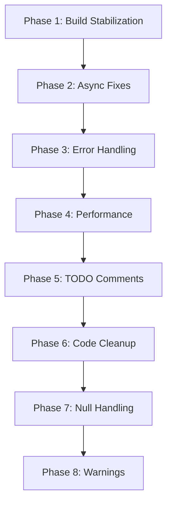

# Technical Debt Task Breakdown - January 13, 2026

**Generated From**: `docs/reports/TECHNICAL_DEBT_REPORT_2026-01-13.md`
**Last Updated**: January 13, 2026 09:00 AM
**Overall Status**: 0/47 tasks complete (0%)

---

## Quick Stats

| Priority | Tasks | Estimated Hours | Status |
|----------|-------|-----------------|--------|
| 🔴 Critical | 11 | 3.5 hours | Not Started |
| 🟠 High | 7 | 5 hours | Not Started |
| 🟡 Medium | 19 | 28 hours | Not Started |
| 🟢 Low | 10 | 16 hours | Not Started |
| **TOTAL** | **47** | **52.5 hours** | **0% Complete** |

---

## Phase 1: Build Stabilization (CRITICAL - 2-3 hours)

### Task 1.1: Fix Presentation Layer Build Errors

- **Priority**: 🔴 CRITICAL
- **Status**: ⏳ Not Started
- **Effort**: 2-3 hours
- **Count**: 24 errors
- **Location**: `src/SaveState.Presentation/`

**Error Categories**:

- Type conversion mismatches
- Missing method implementations
- Constructor parameter issues

**Action Items**:

1. [ ] Run build and capture all 24 errors to file
2. [ ] Categorize errors by type
3. [ ] Fix type conversion issues
4. [ ] Implement missing methods
5. [ ] Resolve constructor parameter problems
6. [ ] Verify full solution builds with 0 errors

**Success Criteria**: ✅ Full solution builds with 0 errors

---

## Phase 2: Critical Async Fixes (CRITICAL - 2 hours)

### Task 2.1: Convert async void to async Task (High Risk)

- **Priority**: 🔴 CRITICAL
- **Status**: ⏳ Not Started
- **Effort**: 30 minutes
- **Count**: 3 methods
- **Risk**: High - Exception swallowing

**Files to Fix**:

1. [ ] `MainShellViewModel.cs` - `OnNavigationRequested`
2. [ ] `MugenHubViewModel.cs` - `OnSectionChanged`
3. [ ] `OverlayContainerViewModel.cs` - `OnOverlayRequested`

**Implementation Pattern**:

```csharp
// Before
private async void OnNavigationRequested(object? sender, NavigationEventArgs e)
{
    await NavigateAsync(e.Route);
}

// After
private async Task OnNavigationRequestedAsync(object? sender, NavigationEventArgs e)
{
    try
    {
        await NavigateAsync(e.Route);
    }
    catch (Exception ex)
    {
        _logger.LogError(ex, "Navigation failed to {Route}", e.Route);
        // Handle error appropriately
    }
}
```

---

### Task 2.2: Convert async void to async Task (Medium Risk)

- **Priority**: 🔴 CRITICAL
- **Status**: ⏳ Not Started
- **Effort**: 30 minutes
- **Count**: 4 methods
- **Risk**: Medium

**Files to Fix**:

1. [ ] `GameDetailViewModel.cs` - `OnPropertyChanged`
2. [ ] `LibraryViewModel.cs` - `OnFilterChanged`
3. [ ] `SettingsViewModel.cs` - `OnThemeChanged`
4. [ ] `QuickSearchViewModel.cs` - `OnSearchTextChanged`

---

### Task 2.3: Fix Sync-over-Async Violations

- **Priority**: 🔴 CRITICAL
- **Status**: ⏳ Not Started
- **Effort**: 30 minutes
- **Count**: 3 violations

**Files to Fix**:

1. [ ] `DialogService.cs` - Replace `.Result` call
2. [ ] `ClipboardService.cs` - Replace `.GetAwaiter().GetResult()`
3. [ ] `TabRegistry.cs` - Replace `.Wait()` call

**Implementation Pattern**:

```csharp
// Before
public string GetData()
{
    return GetDataAsync().Result; // DEADLOCK RISK
}

// After
public async Task<string> GetDataAsync()
{
    return await GetDataAsync();
}
// OR if sync is required:
public string GetData()
{
    return GetDataAsync().GetAwaiter().GetResult(); // Document why sync is needed
}
```

---

### Task 2.4: Replace Thread.Sleep with Task.Delay

- **Priority**: 🔴 CRITICAL
- **Status**: ⏳ Not Started
- **Effort**: 30 minutes
- **Count**: 4 calls

**Files to Fix**:

1. [ ] `MugenLauncher.cs:180` - 100ms process startup wait
2. [ ] `RetroArchService.cs:220` - 500ms emulator initialization
3. [ ] `GameMemoryReader.cs:90` - 50ms memory scan delay
4. [ ] `WindowsMemoryScanner.cs:150` - 100ms scan throttling

**Implementation Pattern**:

```csharp
// Before
Thread.Sleep(100);

// After
await Task.Delay(100, cancellationToken);
```

---

## Phase 3: Error Handling (HIGH - 4 hours)

### Task 3.1: Fix Empty Catch Blocks

- **Priority**: 🟠 HIGH
- **Status**: ⏳ Not Started
- **Effort**: 30 minutes
- **Count**: 3 blocks

**Files to Fix**:

1. [ ] `RetroArchService.cs:150` - Process launch
2. [ ] `MugenLauncher.cs:200` - Engine startup
3. [ ] `ClipboardService.cs:50` - Clipboard access

**Implementation Pattern**:

```csharp
// Before
try
{
    Process.Start(path);
}
catch
{
    // Silent failure - BAD!
}

// After
try
{
    Process.Start(path);
}
catch (Exception ex)
{
    _logger.LogError(ex, "Failed to start process: {Path}", path);
    return Result.Failure($"Process launch failed: {ex.Message}");
}
```

---

### Task 3.2: Convert Critical Return Null to Result Pattern

- **Priority**: 🟠 HIGH
- **Status**: ⏳ Not Started
- **Effort**: 4 hours
- **Count**: ~50 critical path methods

**High Priority Files**:

1. [ ] `DialogService.cs` - 45+ null returns
2. [ ] `GameMemoryReader.cs` - 30+ null returns
3. [ ] Critical ViewModels - 20+ null returns

**Implementation Pattern**:

```csharp
// Before
public Game? GetGame(Guid id)
{
    var game = _context.Games.Find(id);
    return game; // Returns null if not found
}

// After
public Result<Game> GetGame(Guid id)
{
    var game = _context.Games.Find(id);
    return game is not null
        ? Result<Game>.Success(game)
        : Result<Game>.Failure($"Game {id} not found");
}
```

**Files by Priority**:

- **Critical (20 methods)**: DialogService, GameMemoryReader
- **High (30 methods)**: Repository implementations, ViewModels

---

## Phase 4: Performance Optimization (MEDIUM - 4 hours)

### Task 4.1: Fix N+1 Query Pattern - GameRepository

- **Priority**: 🟡 MEDIUM
- **Status**: ⏳ Not Started
- **Effort**: 1 hour
- **Impact**: High
- **File**: `src/SaveState.Infrastructure/Persistence/Repositories/GameRepository.cs`

**Issue**: Lazy loading achievements in loop

**Fix**:

```csharp
// Before (N+1)
var games = await _context.Games.ToListAsync();
foreach (var game in games)
{
    game.Achievements = await _context.Achievements
        .Where(a => a.GameId == game.Id).ToListAsync();
}

// After (Eager Loading)
var games = await _context.Games
    .Include(g => g.Achievements)
    .ToListAsync();
```

---

### Task 4.2: Fix N+1 Query Pattern - MugenCharacterRepository

- **Priority**: 🟡 MEDIUM
- **Status**: ⏳ Not Started
- **Effort**: 45 minutes
- **Impact**: Medium
- **File**: `src/SaveState.Infrastructure/Mugen/Repositories/MugenCharacterRepository.cs`

**Issue**: Lazy loading character moves

---

### Task 4.3: Fix N+1 Query Pattern - VirtualCollectionService

- **Priority**: 🟡 MEDIUM
- **Status**: ⏳ Not Started
- **Effort**: 1 hour
- **Impact**: High
- **File**: `src/SaveState.Infrastructure/GameLibrary/Services/VirtualCollectionService.cs`

**Issue**: Iterative game loading

---

### Task 4.4: Fix N+1 Query Pattern - GameLibraryViewModel

- **Priority**: 🟡 MEDIUM
- **Status**: ⏳ Not Started
- **Effort**: 45 minutes
- **Impact**: Medium
- **File**: `src/SaveState.Presentation/ViewModels/Library/GameLibraryViewModel.cs`

**Issue**: Collection iteration

---

### Task 4.5: Fix N+1 Query Pattern - MugenRosterViewModel

- **Priority**: 🟡 MEDIUM
- **Status**: ⏳ Not Started
- **Effort**: 30 minutes
- **Impact**: Medium
- **File**: `src/SaveState.Presentation/ViewModels/Mugen/MugenRosterViewModel.cs`

**Issue**: Character stats loading

---

### Task 4.6: Fix Remaining N+1 Patterns

- **Priority**: 🟡 MEDIUM
- **Status**: ⏳ Not Started
- **Effort**: 2 hours
- **Count**: 9 additional patterns

**Files to Review**:

- Various repository implementations
- Service layer data access
- ViewModel data loading

---

## Phase 5: Code Quality - TODO Comments (MEDIUM - 8 hours)

### Task 5.1: GameMediaTabViewModel TODOs

- **Priority**: 🟡 MEDIUM
- **Status**: ⏳ Not Started
- **Effort**: 2 hours
- **Count**: 5 items
- **File**: `src/SaveState.Presentation/ViewModels/Library/GameDetail/GameMediaTabViewModel.cs`

**TODO Items**:

1. [ ] Clipboard operations
2. [ ] Logger injection
3. [ ] Media viewer functionality
4. [ ] Full-resolution media loading
5. [ ] Zoom/pan for images

---

### Task 5.2: LibraryViewModel TODOs

- **Priority**: 🟡 MEDIUM
- **Status**: ⏳ Not Started
- **Effort**: 1 hour
- **Count**: 2 items
- **File**: `src/SaveState.Presentation/ViewModels/Library/LibraryViewModel.cs`

**TODO Items**:

1. [ ] Selection mode implementation
2. [ ] Status filtering

---

### Task 5.3: Various ViewModels TODOs

- **Priority**: 🟡 MEDIUM
- **Status**: ⏳ Not Started
- **Effort**: 5 hours
- **Count**: 18 items
- **Locations**: Various ViewModels

**Categories**:

- UI operations
- Service integration
- Command implementations

---

## Phase 6: Code Cleanup (LOW - 8 hours)

### Task 6.1: Remove Console.WriteLine Calls

- **Priority**: 🟢 LOW
- **Status**: ⏳ Not Started
- **Effort**: 1 hour
- **Count**: 45 calls

**Action**: Replace with proper logging or remove entirely

---

### Task 6.2: Remove Debug.WriteLine Calls

- **Priority**: 🟢 LOW
- **Status**: ⏳ Not Started
- **Effort**: 2 hours
- **Count**: 120 calls
- **Location**: ViewModels

**Action**: Replace with structured logging

---

### Task 6.3: Review LogDebug Verbosity

- **Priority**: 🟢 LOW
- **Status**: ⏳ Not Started
- **Effort**: 5 hours
- **Count**: 506 calls

**High Concentration Areas**:

- AI Services: 200+
- MUGEN Services: 150+
- ViewModels: 120+
- Repositories: 100+

**Action**: Review and reduce excessive debug logging

---

## Phase 7: Remaining Null Handling (MEDIUM - 16 hours)

### Task 7.1: Convert Repository Return Nulls

- **Priority**: 🟡 MEDIUM
- **Status**: ⏳ Not Started
- **Effort**: 6 hours
- **Count**: ~40 methods

**Files**: Repository implementations across Infrastructure layer

---

### Task 7.2: Convert Service Return Nulls

- **Priority**: 🟡 MEDIUM
- **Status**: ⏳ Not Started
- **Effort**: 8 hours
- **Count**: ~60 methods

**Files**: Service implementations across Infrastructure layer

---

### Task 7.3: Convert ViewModel Return Nulls

- **Priority**: 🟡 MEDIUM
- **Status**: ⏳ Not Started
- **Effort**: 2 hours
- **Count**: ~30 methods

**Files**: ViewModels in Presentation layer

---

## Phase 8: Warning Suppression Configuration (LOW - 30 minutes)

### Task 8.1: Configure CA1707 Suppression

- **Priority**: 🟢 LOW
- **Status**: ⏳ Not Started
- **Effort**: 15 minutes
- **Count**: 1108 warnings

**Action**: Add to .editorconfig or Directory.Build.props

---

### Task 8.2: Configure CA1848 Suppression

- **Priority**: 🟢 LOW
- **Status**: ⏳ Not Started
- **Effort**: 15 minutes
- **Count**: 2178 warnings

**Action**: Decide on suppression vs. implementation strategy

---

## Task Dependencies



**Critical Path**: Phase 1 → Phase 2 → Phase 3

**Parallel Work Possible**: Phases 4-8 can be worked on independently

---

## Daily Task Recommendations

### Day 1 (Today - Jan 13)

- [ ] **Task 1.1**: Fix all 24 build errors (2-3 hours)
- [ ] **Task 2.1**: Fix high-risk async void methods (30 min)

**Goal**: Get solution building with 0 errors

---

### Day 2 (Jan 14)

- [ ] **Task 2.2**: Fix medium-risk async void methods (30 min)
- [ ] **Task 2.3**: Fix sync-over-async violations (30 min)
- [ ] **Task 2.4**: Replace Thread.Sleep calls (30 min)
- [ ] **Task 3.1**: Fix empty catch blocks (30 min)

**Goal**: Complete all critical async fixes

---

### Day 3 (Jan 15)

- [ ] **Task 3.2**: Convert critical return nulls (4 hours)

**Goal**: Improve error handling in critical paths

---

### Day 4 (Jan 16)

- [ ] **Task 4.1**: Fix GameRepository N+1 (1 hour)
- [ ] **Task 4.2**: Fix MugenCharacterRepository N+1 (45 min)
- [ ] **Task 4.3**: Fix VirtualCollectionService N+1 (1 hour)
- [ ] **Task 4.4**: Fix GameLibraryViewModel N+1 (45 min)

**Goal**: Address major performance bottlenecks

---

### Week 2 (Jan 17-20)

- [ ] **Task 4.5-4.6**: Remaining N+1 patterns (2.5 hours)
- [ ] **Task 5.1-5.3**: TODO comments (8 hours)
- [ ] **Task 6.1-6.2**: Debug output cleanup (3 hours)

**Goal**: Complete medium-priority items

---

### Week 3+ (Jan 21+)

- [ ] **Task 6.3**: LogDebug review (5 hours)
- [ ] **Task 7.1-7.3**: Remaining null handling (16 hours)
- [ ] **Task 8.1-8.2**: Warning configuration (30 min)

**Goal**: Complete low-priority cleanup

---

## Success Metrics

### Sprint Goal (End of Week 1)

```
Build Errors: 0 (from 24)
Async Violations: 0 (from 11)
Empty Catches: 0 (from 3)
Thread.Sleep: 0 (from 4)
Return Null (Critical): 20 (from 50)
N+1 Queries: 9 (from 14)
```

### Month Goal (End of January)

```
Build Errors: 0
TODO Comments: 10 (from 25)
Async Violations: 0
Return Null: 100 (from 227+)
Empty Catches: 0
Thread.Sleep: 0
N+1 Queries: 0
Debug Output: 300 (from 671)
```

---

## Progress Tracking

**Last Updated**: January 13, 2026 09:00 AM

| Phase | Tasks Complete | Total Tasks | % Complete | Hours Spent | Hours Remaining |
|-------|----------------|-------------|------------|-------------|-----------------|
| Phase 1 | 0 | 1 | 0% | 0 | 2.5 |
| Phase 2 | 0 | 4 | 0% | 0 | 2.0 |
| Phase 3 | 0 | 2 | 0% | 0 | 4.5 |
| Phase 4 | 0 | 6 | 0% | 0 | 4.0 |
| Phase 5 | 0 | 3 | 0% | 0 | 8.0 |
| Phase 6 | 0 | 3 | 0% | 0 | 8.0 |
| Phase 7 | 0 | 3 | 0% | 0 | 16.0 |
| Phase 8 | 0 | 2 | 0% | 0 | 0.5 |
| **TOTAL** | **0** | **24** | **0%** | **0** | **45.5** |

---

## Notes

- All tasks follow Result pattern (no null returns)
- All tasks include structured logging
- All tasks maintain test coverage
- Target health score: 95-98/100
- All 515 tests must remain passing

---

**Next Action**: Start with Task 1.1 - Fix Presentation Layer Build Errors
