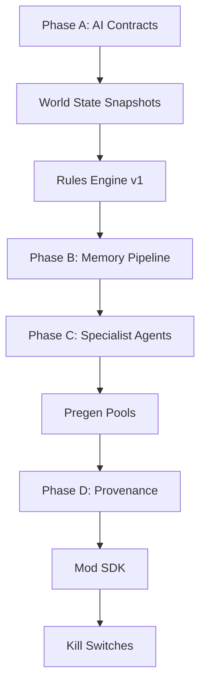

# AI Gaming Hub - Remaining Implementation Plan

Based on analysis of `ai_gaming_hub_detailed_implementation_plan.md` vs. existing codebase.

---

## ✅ Already Implemented

| Section | Component | Status |
|---------|-----------|--------|
| §2 | Memory Stratification | ✅ `ShortTermMemory.cs`, `EpisodicMemory.cs`, `CanonicalMemory.cs` |
| §3 | Intent Routing | ✅ `IntentClassifier.cs`, `EnhancedIntentClassifier.cs` |
| §6 | Lore Locking | ✅ `LoreLocker.cs`, `CanonEnforcer.cs` |
| §7 | Validation Pass | ✅ `OutputValidator.cs`, `EnhancedOutputValidator.cs` |
| §8 | Latency/Caching | ✅ `LatencyManager.cs`, `StreamingHandler.cs` |
| §9 | Player Modeling | ✅ `PlayerTrustModel.cs`, `EnhancedPlayerModelService.cs` |
| §10 | AI Governance | ✅ `AiGovernanceService.cs`, `CapabilityGate.cs`, `FeatureFlagService.cs`, `SafetyRails.cs` |
| §11 | Event Bus | ✅ `AiEventBus.cs`, `EnhancedEventBus.cs`, `GameEvents.cs` |
| §12 | Observability | ✅ `AiTelemetry.cs`, `HallucinationDetector.cs` |
| §13 | Testing Harness | ✅ `AiTestHarness.cs`, `FakePlayerSimulator.cs` |
| §14 | Graceful Degradation | ✅ `FailureAsContent.cs`, `ResilientAiService.cs` |
| §15 | Provider Abstraction | ✅ `LlmService.cs` with model adapters |

---

## 🔨 Remaining Work (Priority Order)

### Phase A: Ship-Safe Backbone (Next)

#### 1. AI Contract System (§16)
>
> [!IMPORTANT]
> This is the control plane - every request must be bound to a contract

- [ ] **[NEW]** `Contracts/AiContract.cs` - Contract schema + version
- [ ] **[NEW]** `Contracts/ContractRegistry.cs` - Store and lookup contracts
- [ ] **[NEW]** `Contracts/PolicyGateMiddleware.cs` - Enforce contracts at gateway
- [ ] **[MODIFY]** Wire PolicyGate into `ProductionAiService.cs`

#### 2. World State Snapshot Builder (§4)

- [ ] **[NEW]** `State/WorldStateSnapshot.cs` - Snapshot data model
- [ ] **[NEW]** `State/SnapshotBuilder.cs` - Build minimal snapshots
- [ ] **[NEW]** `State/StateInjector.cs` - Inject into agent context

#### 3. Rules Engine v1 (§5)

- [ ] **[NEW]** `Rules/RulesEngine.cs` - `validate_action`, `resolve_action`
- [ ] **[NEW]** `Rules/QuestTransitionRules.cs`
- [ ] **[NEW]** `Rules/EconomyGuardrails.cs`

---

### Phase B: Reality & Continuity

#### 4. Narrative Compression Pipeline (§2.2)

- [ ] **[MODIFY]** Enhance `NarrativeCompressor.cs` with summarization streams

#### 5. Memory Write Pipeline (§2.2)

- [ ] **[NEW]** `Memory/MemoryWritePipeline.cs` - Event → Summarize → Store

---

### Phase C: Quality/Speed/Cost

#### 6. Specialist Agents (§3.2)

- [ ] **[NEW]** `Agents/LoreQueryAgent.cs`
- [ ] **[NEW]** `Agents/NarrativeDialogueAgent.cs`
- [ ] **[NEW]** `Agents/QuestSuggestionAgent.cs`
- [ ] **[NEW]** `Agents/CombatExplanationAgent.cs`
- [ ] **[NEW]** `Agents/BuildOptimizationAgent.cs`

#### 7. Pre-Generation Pools (§8.2)

- [ ] **[NEW]** `Pregen/PregenPoolService.cs`
- [ ] **[NEW]** `Pregen/BanterPool.cs`
- [ ] **[NEW]** `Pregen/RumorPool.cs`

---

### Phase D: Platformization

#### 8. Provenance Ledger (§17)

- [ ] **[NEW]** `Provenance/ProvenanceLedger.cs`
- [ ] **[NEW]** `Provenance/ArtifactRecord.cs`
- [ ] **[NEW]** `Provenance/RollbackService.cs`

#### 9. Mod SDK & Sandbox (§18)

- [ ] **[NEW]** `Mods/ModGateway.cs`
- [ ] **[NEW]** `Mods/ModValidator.cs`
- [ ] **[NEW]** `Mods/SandboxEnvironment.cs`

#### 10. Kill Switches (§21)

- [ ] **[NEW]** `Emergency/KillSwitchService.cs`
- [ ] **[NEW]** `Emergency/NarrativeFreezeService.cs`

#### 11. Drift Control (§22)

- [ ] **[NEW]** `Drift/StyleAnchorService.cs`
- [ ] **[NEW]** `Drift/ToneRegressionTests.cs`

---

## Proposed Implementation Order



---

## Verification Plan

### Build Verification

```bash
dotnet build
dotnet test
```

### Integration Tests

- Contract enforcement test suite
- Rules engine compliance tests
- Provenance lineage tests

---

## User Review Required

> [!IMPORTANT]
> This is a large implementation scope. Please confirm:
>
> 1. Start with Phase A (Contracts + Snapshots + Rules Engine)?
> 2. Any specific components to prioritize or skip?
> 3. Acceptable to implement in multiple sessions?
