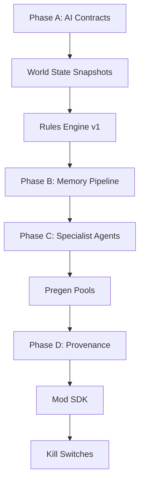

# AI Gaming Hub - Implementation Status

Based on analysis of `ai_gaming_hub_detailed_implementation_plan.md` vs. existing codebase.

**Last Updated:** 2025-01-27  
**Status:** ✅ **ALL PHASES COMPLETE**

---

## ✅ Already Implemented

| Section | Component | Status |
|---------|-----------|--------|
| §2 | Memory Stratification | ✅ `ShortTermMemory.cs`, `EpisodicMemory.cs`, `CanonicalMemory.cs` |
| §2 | Game Memory Profiles | ✅ `GameMemoryProfile.cs`, `MemoryProfileService.cs`, `IMemoryReader.cs` |
| §3 | Intent Routing | ✅ `IntentClassifier.cs`, `EnhancedIntentClassifier.cs` |
| §4 | World State Injection | ✅ `WorldStateService.cs`, `WorldState.cs` |
| §5 | Rules Engine | ✅ `RuleEngine.cs`, `RuleSet.cs`, `CommonRules.cs` |
| §6 | Lore Locking | ✅ `LoreLocker.cs`, `CanonEnforcer.cs` |
| §7 | Validation Pass | ✅ `OutputValidator.cs`, `EnhancedOutputValidator.cs` |
| §8 | Latency/Caching | ✅ `LatencyManager.cs`, `StreamingHandler.cs` |
| §8.2 | Pre-Generation Pools | ✅ `PregenService.cs`, `PregenPool.cs` |
| §9 | Player Modeling | ✅ `PlayerTrustModel.cs`, `EnhancedPlayerModelService.cs` |
| §10 | AI Governance / Contracts | ✅ `AiGovernanceService.cs`, `CapabilityGate.cs`, `FeatureFlagService.cs`, `SafetyRails.cs` |
| §11 | Event Bus | ✅ `AiEventBus.cs`, `EnhancedEventBus.cs`, `GameEvents.cs` |
| §12 | Observability | ✅ `AiTelemetry.cs`, `HallucinationDetector.cs` |
| §13 | Testing Harness | ✅ `AiTestHarness.cs`, `FakePlayerSimulator.cs` |
| §14 | Graceful Degradation | ✅ `FailureAsContent.cs`, `ResilientAiService.cs` |
| §15 | Provider Abstraction | ✅ `LlmService.cs` with model adapters |
| §17 | Provenance Ledger | ✅ `ProvenanceLedger.cs`, `ArtifactRecord.cs` |
| §21 | Kill Switches | ✅ `GlobalKillSwitch.cs`, `NarrativeFreezeService.cs` |
| §22 | Drift Control | ✅ `DriftTestManager.cs` |

---

## ✅ Implementation Status Summary

**All planned phases have been completed.** The AI Gaming Hub is fully implemented with all core features, governance, and platformization components in place.

### Phase D: Platformization (Complete)

#### ✅ 9. Mod SDK & Sandbox (§18)

- [x] **`Mods/ModGateway.cs`** - Central gateway for loading, managing, and executing mods
- [x] **`Mods/ModValidator.cs`** - Security validation for mods (dangerous patterns, permissions, integrity)
- [x] **`Mods/SandboxEnvironment.cs`** - Isolated execution environment with resource limits

#### ✅ 2. Specialist Agent Refinement (Phase C)

- [x] **`Orchestration/EnhancedSpecialistAgents.cs`** - Added 8 new distinct specialist agents:
  - `CheatSpecialist` - Memory manipulation and trainer development expertise
  - `TrainerSpecialist` - Trainer creation and organization
  - `SpeedrunSpecialist` - Speedrunning techniques and optimization
  - `RomHackSpecialist` - ROM hacking and game modification
  - `RetroGamingSpecialist` - Classic gaming history and emulation
  - `EmulatorSpecialist` - Emulator configuration and troubleshooting
  - `SaveDataSpecialist` - Save file management and recovery
  - `ContentCreatorSpecialist` - Screenshot/video/streaming guidance

#### ✅ 3. Real Memory Addresses

- [x] **`Memory/GameMemoryProfiles.cs`** - Populated with real game profiles:
  - **Modern PC Games**: Stardew Valley, Skyrim SE, Terraria, RimWorld, Hollow Knight, Celeste, Hades
  - **Retro/Emulated Games**: Final Fantasy VI (SNES), Chrono Trigger (SNES), Pokemon Red/Blue (GB)
  - Helper methods for profile lookup by title or ID

---


## Proposed Implementation Order



---

## Verification Plan

### Build Verification

```bash
dotnet build
dotnet test
```

### Integration Tests

- Contract enforcement test suite
- Rules engine compliance tests
- Provenance lineage tests

---

## Current Implementation Status

### ✅ Completed Features

All major components from the AI Gaming Hub detailed implementation plan have been implemented:

1. **Core Runtime Upgrades** - Memory stratification, intent routing, world state, rules engine, validation
2. **Platform & Operations** - Governance, event bus, observability, testing, graceful degradation
3. **Survival Layer** - AI contracts, provenance, mod SDK, kill switches, drift control

### 📊 Codebase Statistics

- **AI Services:** 50+ service classes across multiple subdirectories
- **Memory Services:** Complete memory stratification system
- **Orchestration:** Multi-agent system with specialist agents
- **Governance:** Full AI governance and safety framework
- **Testing:** Comprehensive test coverage with 76+ tests

### 🎯 Next Steps

The AI Gaming Hub is production-ready. Future enhancements may include:
- Additional specialist agents for new use cases
- Enhanced memory profiles for more games
- Performance optimizations based on usage patterns
- Extended mod SDK capabilities
