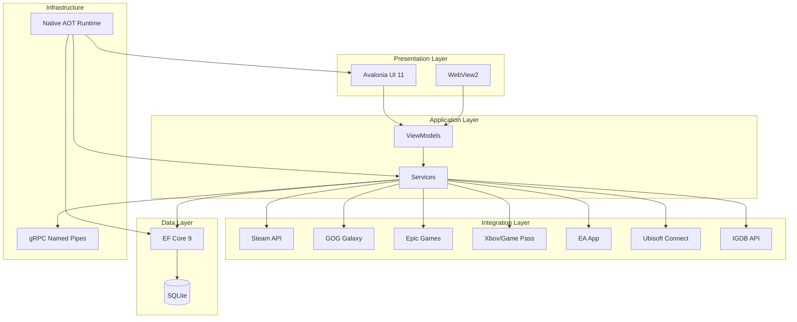

# SaveState Reborn: White Paper
## A Modern Game Library Platform

**Document ID:** SS-WP-001  
**Revision:** 2.0  
**Classification:** Engineering Reference  
**Date:** 2024-12-20  
**Last Updated:** 2025-01-27

---

## 1. Executive Summary

SaveState Reborn is a next-generation game library management platform designed to unify PC gaming across all major storefronts while providing comprehensive retro-gaming support. Built from the ground up using cutting-edge technologies, it prioritizes performance, maintainability, and cross-platform capability. The platform includes advanced AI-powered features for game assistance, cheat detection, trainer generation, and immersive gaming experiences.

### Mission Statement
> Deliver the fastest, most reliable game library experience by leveraging Native AOT compilation, modern UI frameworks, and first-party integrations with zero third-party plugin dependencies.

---

## 2. Requirements Hierarchy

### 2.1 Functional Requirements

| ID | Requirement | Priority | Status |
|----|-------------|----------|--------|
| FR-001 | Import game libraries from Steam, GOG, Epic, Xbox, EA, Ubisoft | Critical | ✅ Implemented (6/10 providers) |
| FR-001a | Import from Amazon, itch.io, Humble, PlayStation | Medium | ⏳ Planned |
| FR-002 | Fetch metadata (artwork, descriptions, playtime estimates) from IGDB and SteamGridDB | Critical | ✅ Implemented |
| FR-003 | Manage ROM collections with automatic organization and scraping | Critical | ✅ Implemented |
| FR-004 | Track achievements via RetroAchievements integration | High | ✅ Implemented |
| FR-005 | Launch games with automatic store client handling | Critical | ✅ Implemented |
| FR-006 | BIOS management for emulator configuration | High | ✅ Implemented |
| FR-007 | Single-instance enforcement with command passing | Medium | ✅ Implemented |
| FR-008 | AI-powered game assistance and cheat detection | High | ✅ Implemented |
| FR-009 | Trainer generation from memory scans | High | ✅ Implemented |
| FR-010 | MUGEN fighting game integration | Medium | ✅ Implemented |
| FR-011 | Emulator enhancements (dream sequences, memory evolution, shaders) | Medium | ✅ Implemented |
| FR-012 | Knowledge base and RAG for game information | Medium | ✅ Implemented |

### 2.2 Non-Functional Requirements

| ID | Requirement | Target |
|----|-------------|--------|
| NFR-001 | Application startup time | < 200ms |
| NFR-002 | Memory footprint (idle) | < 100MB |
| NFR-003 | Binary size (installed) | < 50MB |
| NFR-004 | Platform support | Windows 10+, Linux, macOS |
| NFR-005 | Framework support lifecycle | .NET 9 → .NET 10 LTS migration path |

---

## 3. Technology Stack

### 3.1 Decision Matrix

| Component | Selected Technology | Alternatives Considered | Rationale |
|-----------|---------------------|------------------------|-----------|
| **Runtime** | .NET 9 + C# 13 | .NET 8 LTS | Latest features, Native AOT improvements, 18-month support window acceptable |
| **Compilation** | Native AOT | JIT | 10x faster startup, smaller binaries, no runtime dependency |
| **UI Framework** | Avalonia UI 11 | WPF, MAUI, Blazor | True cross-platform, XAML familiarity, AOT-compatible, active development |
| **Database** | SQLite + EF Core 9 | PostgreSQL + Marten, LiteDB | Embedded, zero-install, portable, modern ORM |
| **IPC** | gRPC over Named Pipes | WCF, raw Named Pipes, SignalR | Strongly-typed contracts, binary efficiency, local-only optimization |
| **Browser Control** | WebView2 | CefSharp, Photino | Native .NET support, ships with Windows, Edge-based |

### 3.2 Dependency Graph



---

## 4. Architecture Overview

### 4.1 Layer Definitions

| Layer | Responsibility | Key Components |
|-------|---------------|----------------|
| **Presentation** | User interface rendering, input handling | Avalonia Views, WebView2 panels |
| **ViewModel** | UI state management, command binding | CommunityToolkit.Mvvm ViewModels |
| **Service** | Business logic, integrations | Store importers, metadata fetchers, ROM managers |
| **Data** | Persistence, caching | EF Core DbContext, SQLite |
| **Infrastructure** | Cross-cutting concerns | IPC, logging, configuration |

### 4.2 Store Integration Architecture

Each store integration follows the **Provider Pattern**:

```
IGameProvider
├── SteamProvider ✅
├── GogProvider ✅
├── EpicProvider ✅
├── XboxProvider ✅
├── EaProvider ✅
├── UbisoftProvider ✅
├── AmazonProvider ⏳ (Planned)
├── ItchProvider ⏳ (Planned)
├── HumbleProvider ⏳ (Planned)
└── PlayStationProvider ⏳ (Planned)
```

Each provider implements:
- `GetInstalledGamesAsync()` - Discover locally installed games
- `GetOwnedGamesAsync()` - Fetch cloud library via API
- `LaunchGameAsync(Game game)` - Start game with proper client

**Current Status:** 6 of 10 planned providers are implemented. The core provider infrastructure is complete and additional providers can be added following the same pattern.

### 4.3 AI Architecture

SaveState includes a comprehensive AI-powered gaming assistant system:

**Core AI Services:**
- **LLM Service** - Provider abstraction for OpenAI, Gemini, and Ollama
- **RAG Service** - Retrieval-Augmented Generation for game knowledge
- **Advanced AI Service** - Unified AI orchestration
- **Memory Services** - Stratified memory (short-term, episodic, canonical)
- **Rules Engine** - Deterministic validation and rule enforcement
- **World State Service** - Game state management and injection

**Specialized AI Features:**
- **Cheat Agent Service** - AI-powered cheat detection and trainer generation
- **Memory Scanner** - Real-time memory scanning with game profiles
- **Trainer Generator** - Automatic trainer creation from memory scans
- **Knowledge Base** - RAG-powered game information system
- **Orchestration** - Multi-agent system with specialist agents

**AI Governance:**
- **Governance Service** - Capability gating and policy enforcement
- **Kill Switches** - Global and feature-specific kill switches
- **Safety Rails** - Content safety and validation
- **Telemetry** - AI performance and usage monitoring

---

## 5. Risk Assessment

| Risk ID | Description | Likelihood | Impact | Mitigation |
|---------|-------------|------------|--------|------------|
| R-001 | .NET 9 EOL in 18 months | Certain | Medium | Plan .NET 10 LTS migration for Q4 2025 |
| R-002 | Store API changes break integrations | Medium | High | Abstract behind provider interface, automated testing |
| R-003 | Native AOT limits dynamic scenarios | Low | Medium | Design all integrations as compile-time; no plugins |
| R-004 | WebView2 runtime not installed | Low | Medium | Include WebView2 bootstrapper in installer |
| R-005 | Cross-platform parity issues | Medium | Medium | Prioritize Windows, validate Linux/macOS quarterly |

---

## 6. Trade-Off Analysis

### 6.1 Plugin System vs. Native AOT

| Factor | Plugin System (JIT) | Native AOT (No Plugins) |
|--------|---------------------|-------------------------|
| Startup time | ~1-2 seconds | ~100-200ms |
| Binary size | ~150MB | ~40MB |
| Extensibility | Community plugins | First-party only |
| Maintenance | Plugin compatibility burden | Full control |
| **Decision** | — | ✅ Selected |

**Rationale:** With first-party integrations for all major stores, the plugin ecosystem provides diminishing returns while adding startup latency and maintenance burden.

### 6.2 WPF vs. Avalonia

| Factor | WPF | Avalonia |
|--------|-----|----------|
| Platform | Windows only | Windows, Linux, macOS, Web |
| Minimum OS | Windows 7 | Windows 10 |
| AOT support | Limited | Full |
| Development velocity | Mature but stagnant | Active, modern patterns |
| **Decision** | — | ✅ Selected |

---

## 7. Standards Compliance

| Standard | Applicability | Status |
|----------|--------------|--------|
| .NET Code Style (editorconfig) | All C# code | Enforced |
| MVVM Pattern | UI/ViewModel separation | Required |
| SOLID Principles | Service layer design | Required |
| Semantic Versioning | Release management | Required |
| SPDX License Identifiers | Dependency management | Required |

---

## 8. Glossary

| Term | Definition |
|------|------------|
| **Native AOT** | Ahead-of-Time compilation producing native executables without JIT |
| **Provider** | Implementation of store-specific game discovery and launch logic |
| **ROM** | Read-Only Memory dump of a game cartridge/disc for emulation |
| **IPC** | Inter-Process Communication for single-instance coordination |
| **IGDB** | Internet Game Database - metadata source |

---

## Appendix A: Version History

| Version | Date | Author | Changes |
|---------|------|--------|---------|
| 1.0 | 2024-12-20 | Antigravity | Initial specification |
| 2.0 | 2025-01-27 | Documentation Update | Updated to reflect current implementation status, added AI features, updated provider status |

---

## Appendix B: Approval

| Role | Name | Date | Signature |
|------|------|------|-----------|
| Technical Lead | _________________ | ________ | ________ |
| Project Manager | _________________ | ________ | ________ |
